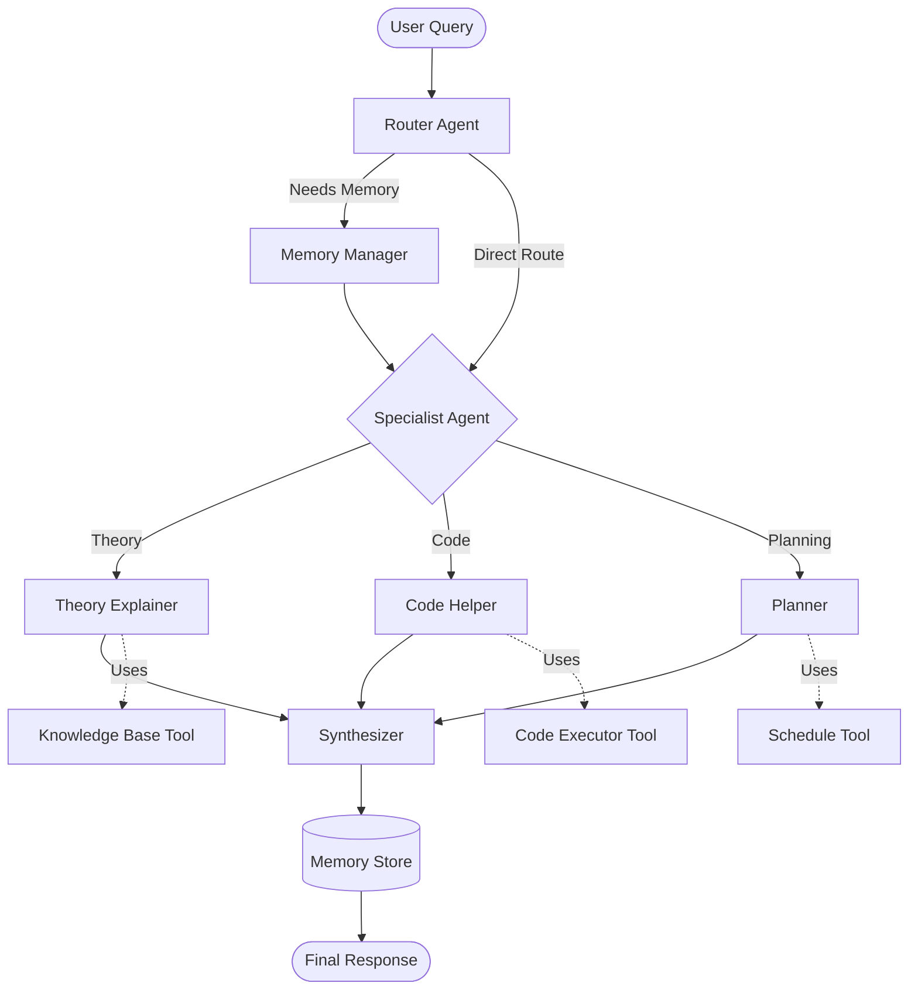

# Laboratory work 2: Designing and Implementing a Multi-Agent System with LangChain & LangGraph

**Scenario:** Multi-Agent Study & Productivity Assistant

**Student:** Fedotova Karina, group J4233

## Overview

This project implements a multi-agent system using LangChain and LangGraph to help with study, coding, and productivity tasks. The system uses a **Router + Specialists** pattern where a router agent analyzes queries and dispatches them to specialized agents, with memory management across interactions.

The system helps with realistic tasks including:
- **Study assistance:** Explaining theoretical concepts, creating study plans;
- **Coding help:** Providing code examples, debugging assistance, best practices;
- **Productivity planning:** Creating structured study schedules and task breakdowns.

## Architecture

### Design Pattern: Router + Specialists with Memory

The system implements a **Router + Specialists** pattern, which is a common MAS pattern where:
- A **Router Agent** acts as the entry point, analyzing queries and deciding which specialized agents should handle them;
- **Specialist Agents** handle specific types of tasks (theory explanation, coding help, planning);
- A **Memory Manager** maintains context across interactions;
- A **Synthesizer** combines outputs from multiple agents into a final response.

### Agents

1. **Router Agent** (`router`)
   - **Role:** Query classifier and dispatcher;
   - **Responsibilities:**
     - Analyzes user queries;
     - Classifies query type (theory, code, planning, general, memory);
     - Decides which specialist agents to involve;
     - Determines if memory retrieval or tool calling is needed;
   - **Output:** `RoutingDecision` (Pydantic model).

2. **Theory Explainer Agent** (`theory_explainer`)
   - **Role:** Educational assistant for theoretical concepts;
   - **Responsibilities:**
     - Explains concepts clearly and comprehensively;
     - Provides key points, examples, and related concepts;
     - Uses knowledge base tool for common concepts;
   - **Output:** `TheoryExplanation` (Pydantic model).

3. **Code Helper Agent** (`code_helper`)
   - **Role:** Programming assistant;
   - **Responsibilities:**
     - Helps with coding questions and debugging;
     - Provides code examples and best practices;
     - Uses code executor tool for simple code snippets;
   - **Output:** `CodeHelp` (Pydantic model).

4. **Planner Agent** (`planner`)
   - **Role:** Study planning and scheduling assistant;
   - **Responsibilities:**
     - Creates structured study plans;
     - Breaks down goals into steps with time estimates;
     - Uses schedule tool for time management;
   - **Output:** `StudyPlan` (Pydantic model).

5. **Memory Manager Agent** (`memory_manager`)
   - **Role:** Context and history manager;
   - **Responsibilities:**
     - Retrieves relevant context from previous interactions;
     - Stores user preferences and profile information;
     - Maintains session history;
   - **Output:** `MemoryUpdate` (Pydantic model).

6. **Synthesizer** (`synthesizer`)
   - **Role:** Response aggregator;
   - **Responsibilities:**
     - Combines outputs from multiple agents;
     - Formats final response for the user;
     - Stores interaction in memory;
   - **Output:** `FinalResponse` (Pydantic model).

### Tools

The system includes 4 tools that agents can use:

1. **Calculator Tool** - evaluates mathematical expressions;
2. **Code Executor Tool** - executes simple Python code snippets safely;
3. **Schedule Tool** - parses time durations and formats schedules;
4. **Knowledge Base Tool** - simple in-memory knowledge base for common concepts.

### Memory Management

Memory is managed through a `MemoryStore` class that:
- Stores session history (last 20 interactions);
- Maintains user profile (topics asked, coding languages, study goals);
- Provides context retrieval for relevant previous discussions;
- Persists to a JSON file (`memory_store.json`).

### State Management

The system uses a `MultiAgentState` TypedDict (defined in `src/graph.py`) that contains all required fields:

**User Input:**
- `user_query: str` - The user's question/query

**Intermediate Fields:**
- `routing_decision: Optional[RoutingDecision]` - Classification and routing decision;
- `theory_explanation: Optional[TheoryExplanation]` - Partial response from theory agent;
- `code_help: Optional[CodeHelp]` - Partial response from code agent;
- `study_plan: Optional[StudyPlan]` - Partial response from planner agent;
- `memory_update: Optional[MemoryUpdate]` - Memory retrieval/update information.

**Final Answer:**
- `final_response: Optional[FinalResponse]` - Final synthesized response

**Memory-Related Fields:**
- `memory_context: Optional[str]` - Retrieved context from previous interactions;
- Session history is maintained in `MemoryStore` class and persisted to `memory_store.json`;
- User profile (topics, languages, goals) stored in memory.

**Control Flow:**
- `agents_involved: List[str]` - Tracks which agents participated;
- `tools_used: List[str]` - Tracks which tools were called;
- `error: Optional[str]` - Error messages if any.

## Flow Diagram

The following diagram shows the control flow and data movement through the system:



### Flow Description

1. **Entry Point:** User query enters through the Router Agent
2. **Router Decision:** Router analyzes query and decides:
   - Query type (theory, code, planning, memory, general);
   - Which specialist agents to involve;
   - Whether memory retrieval is needed;
   - Whether tools might be needed.
3. **Memory Retrieval (if needed):** If `needs_memory=True`, Memory Manager retrieves relevant context from previous interactions.
4. **Specialist Processing:** Appropriate specialist agent processes the query:
   - Theory Explainer for conceptual questions;
   - Code Helper for implementation questions;
   - Planner for study planning questions.
5. **Tool Calling:** Agents call tools as needed:
   - Theory Explainer -> Knowledge Base Tool (for common concepts);
   - Code Helper -> Code Executor Tool (for code execution);
   - Planner -> Schedule Tool (for time management).
6. **Synthesis:** Synthesizer combines all agent outputs into a coherent final response.
7. **Memory Storage:** Interaction is stored in Memory Store for future reference.
8. **Response:** Final response returned to user.

### Tool Calling Details

**Where tools are called and for what purpose:**

- **Knowledge Base Tool** (`src/tools.py:KnowledgeBaseTool`)
  - Called by: Theory Explainer Agent;
  - Purpose: Provides quick access to definitions of common concepts;
  - When: During concept explanation to enhance responses with predefined knowledge.

- **Code Executor Tool** (`src/tools.py:CodeExecutorTool`)
  - Called by: Code Helper Agent;
  - Purpose: Executes simple Python code snippets safely with timeout and security restrictions;
  - When: User asks for code examples that can be tested/verified.

- **Schedule Tool** (`src/tools.py:ScheduleTool`)
  - Called by: Planner Agent;
  - Purpose: Parses time duration strings and formats study schedules;
  - When: Creating study plans with time estimates.

- **Calculator Tool** (`src/tools.py:CalculatorTool`)
  - Available to: All agents (if needed);
  - Purpose: Evaluates mathematical expressions safely;
  - When: Queries involve calculations.

### Memory Management Details

**What is stored:**

1. **Session History:**
   - Last 20 interactions stored in `memory_store.json`;
   - Each interaction contains: timestamp, user query, response (first 500 chars), agents involved.

2. **User Profile:**
   - Topics asked about (for personalization);
   - Coding languages mentioned;
   - Study goals set.

3. **Context Dictionary:**
   - General context for extensibility.

**Where it is stored:**

- File-based storage: `memory_store.json` (created in project root or specified path);
- In-memory during execution: `MemoryStore` class maintains state;
- Persisted across sessions: JSON file persists between runs.

**How memory influences later steps:**

1. **State Fields for Memory:**
   - `memory_context: Optional[str]` in `MultiAgentState` accumulates retrieved context;
   - `memory_update: Optional[MemoryUpdate]` stores memory action information;
   - State fields accumulate previous questions/answers within the session.

2. **History Store:**
   - `MemoryStore` class maintains a tiny "history store" in memory during execution;
   - Persisted to simple JSON file (`memory_store.json`) for cross-session persistence;
   - Stores last 20 interactions with timestamps, queries, responses, and agents involved.

3. **RAG-style Retrieval:**
   - `search_history()` method implements keyword-based search over stored notes/interactions;
   - Searches for relevant previous discussions based on query keywords;
   - Retrieves context that influences later steps.

4. **Memory Influence on Steps:**
   - **Router Stage:** Router can request memory retrieval if query suggests context is needed;
   - **Memory Manager Stage:** Retrieves recent interactions and searches history, provides context to state;
   - **Specialist Agent Stage:** Agents receive `memory_context` from state as additional input;
   - **Synthesizer Stage:** Stores new interaction in memory and updates user profile.

## Installation

1. Install dependencies:
```bash
pip install -r requirements.txt
```

2. Set up environment variables (optional - defaults are from Lab 1):
```bash
# Create .env file or set environment variables
# These are the same variables used in Lab 1:
LITELLM_BASE_URL=http://a6k2.dgx:34000/v1
LITELLM_API_KEY=sk-jZkA340PLjFS8B47HeFHsw
MODEL_NAME=qwen3-32b
```
## Usage

### Command Line

```bash
python main.py "What is a multi-agent system?"
```

Or run in interactive mode:
```bash
python main.py
```

### Python Script

```python
import asyncio
from src.graph import MultiAgentSystem

async def main():
    system = MultiAgentSystem()
    result = await system.process_query("Explain LangGraph architecture")
    print(result["final_response"].answer)

asyncio.run(main())
```

### Jupyter Notebook

The fastest way to get started is through the Jupyter notebook:

1. Open `notebooks/experiments.ipynb`
2. Run the setup cells to import modules
3. Initialize the system: `system = MultiAgentSystem()`
4. Process queries: `result = await system.process_query("Your query here")`

Example:
```python
# In a notebook cell
system = MultiAgentSystem()
result = await system.process_query("What is a multi-agent system?")
print(result["final_response"].answer)
```

The notebook also contains 5 complete experiments with detailed analysis.

## Technical Details

### Model Configuration

- **Model:** Qwen3-32B via vLLM;
- **Endpoint:** OpenAI-compatible API endpoint;
- **Configuration:** Uses the same variables from Lab 1:
  - `LITELLM_BASE_URL` (default: `http://a6k2.dgx:34000/v1`);
  - `LITELLM_API_KEY` (default: `your_api_key`);
  - `MODEL_NAME` (default: `qwen3-32b`).
- **Access Pattern:** All agents use `ChatOpenAI` from `langchain-openai` with `base_url` pointing to vLLM endpoint;
- **Retry Logic:** Implemented for Pydantic parsing (max 3 retries);
- **Temperature:** Varies by agent (router: 0.1, theory: 0.7, code: 0.3, planner: 0.5);
- **Libraries:** `langchain-openai`, `langgraph`, `langchain-core` (as required).

### Pydantic Models

All agents use Pydantic models for structured outputs:
- `RoutingDecision` - Router output;
- `TheoryExplanation` - Theory explainer output;
- `CodeHelp` - Code helper output;
- `StudyPlan` - Planner output;
- `MemoryUpdate` - Memory manager output;
- `FinalResponse` - Final system response.

Retry logic is implemented in the LLM initialization (`max_retries=3`) to handle parsing errors.

### Implementation Details

**LangGraph Graph Structure:**
- The system is implemented as a LangGraph `StateGraph` using `MultiAgentState` TypedDict;
- Each agent corresponds to a node in the graph;
- Nodes are connected via conditional edges based on routing decisions.

**Node Implementation:**
Each node (agent) follows this pattern:
1. **Reads** relevant parts of the shared state (`MultiAgentState`);
2. **Calls Qwen LLM** via LangChain using `ChatOpenAI` with vLLM endpoint:
   - Uses `base_url` from config;
   - Uses `api_key` from config;
   - Uses `model_name` from config (qwen3-32b);
   - Each agent has different prompts and temperature settings.
3. **Optionally calls tools** (e.g., Knowledge Base, Code Executor, Schedule Tool);
4. **Updates state** with its results (Pydantic model outputs).

**Handoff Logic:**
Handoff between agents is implemented through:
1. **Conditional routing** in LangGraph based on routing decisions (`route_after_router`, `route_after_memory` functions);
2. **State passing** through the shared `MultiAgentState` TypedDict;
3. **Memory context** passed to specialist agents when needed;
4. **Path through graph** depends on query type and intermediate state (routing decision determines which specialist to use).

### Tool Calling

Tools are called by agents as needed:
- Theory Explainer uses Knowledge Base Tool;
- Code Helper uses Code Executor Tool;
- Planner uses Schedule Tool;
- Calculator Tool available for mathematical queries.

## Experiments

In `notebooks/experiments.ipynb` you can see:
- 5 test queries covering different scenarios:
  - One conceptual/theoretical question about MAS;
  - One design/architecture question;
  - One implementation/coding question;
  - Two queries related to everyday tasks (study planning, memory retrieval).
- Analysis of agent routing and handoff;
- Tool usage tracking;
- Memory effectiveness evaluation;
- Performance observations;
- Evaluation section with informal criteria.

## Design Scheme

### MAS Pattern Implementation: Router + Specialists with Memory

The system implements a **Router + Specialists** pattern, which is a common MAS pattern where:

- **Router Agent** acts as the entry point and dispatcher, analyzing queries and deciding routing;
- **Specialist Agents** handle specific types of tasks (theory explanation, coding help, planning);
- **Memory Manager** maintains context across interactions;
- **Synthesizer** combines outputs from multiple agents into a coherent response.

This pattern is chosen because:
- It allows for clear separation of concerns;
- Each agent can be specialized and optimized for its task;
- The router provides intelligent routing based on query analysis;
- Memory enables context-aware responses.

### How the Pattern is Reflected in the Design

1. **Entry Point:** All queries enter through the Router Agent;
2. **Routing Decision:** Router analyzes query and decides which specialists to involve;
3. **Memory Check:** If memory is needed, Memory Manager retrieves context first;
4. **Specialist Processing:** Appropriate specialist agents process the query;
5. **Synthesis:** Synthesizer combines all outputs into final response;
6. **Memory Update:** Interaction is stored in memory for future reference.

## Reflection

### What Worked Well

1. **Router Pattern:** The router agent successfully classified 4 out of 5 queries correctly, with clear reasoning for each decision. The Pydantic `RoutingDecision` model provided structured, interpretable routing logic.

2. **Structured Outputs:** Pydantic models ensured consistent, parseable outputs from all agents:
   - `TheoryExplanation` provided structured explanations with key points and examples;
   - `CodeHelp` delivered actionable code with best practices;
   - `StudyPlan` created detailed, time-bound plans with resources;
   - `MemoryUpdate` successfully retrieved and formatted context.

3. **Tool Integration:** Tools were called appropriately:
   - Code executor activated for coding questions;
   - Schedule tool used for planning tasks;
   - No unnecessary tool calls for theoretical questions.

4. **Memory Management:** The memory system successfully stored and retrieved session history. Memory retrieval correctly activated when explicitly requested and provided relevant context.

5. **Modular Design:** Each agent operated independently with clear responsibilities, making the system easy to understand and extend.

6. **Handoff Logic:** Conditional routing in LangGraph worked effectively, allowing the system to dynamically choose the appropriate agent based on query analysis.

### Challenges and Limitations

1. **Routing Nuance:** In some cases, design/architecture questions were classified as theory. While the response was good, a more specific "design" query type could improve routing precision.

2. **Proactive Memory Usage:** The system didn't proactively use memory in some cases where context would have been helpful (e.g., when router noted previous related discussions but didn't activate memory retrieval).

3. **Memory Response Synthesis:** Memory retrieval worked but responses mainly showed raw context. A more synthesized summary of previous discussions would be more useful.

4. **Multi-Agent Coordination:** When the router suggested multiple agents, only one was typically used. Parallel execution of multiple agents could provide richer responses.

5. **Code Executor Limitations:** While the code executor was used, security restrictions limit its capabilities. More sophisticated code analysis tools would be beneficial.

### Future Improvements

1. **Enhanced Routing:** Add a specific "design" query type for architecture questions, or improve the router to better distinguish between theoretical explanations and design guidance.

2. **Proactive Memory:** Implement logic to automatically retrieve relevant context when the router detects related previous discussions, even if not explicitly requested.

3. **Memory Synthesis:** Improve the memory manager to synthesize retrieved context into a coherent summary rather than just showing raw previous interactions.

4. **Parallel Agent Execution:** When the router suggests multiple agents, allow them to work in parallel and combine their outputs more effectively.

5. **Semantic Memory Search:** Replace keyword-based memory search with semantic search using embeddings for better context retrieval, especially for related but not identical topics.

6. **Reviewer Agent:** Add an agent that reviews and improves responses before final output, ensuring consistency and quality across all interactions.

7. **Better Tools:** Integrate more sophisticated tools:
   - Web search for up-to-date information
   - Code analysis tools beyond simple execution
   - Documentation lookup for LangGraph/LangChain APIs

8. **Planner-Executor Pattern:** Implement a more sophisticated planner-executor pattern for complex multi-step tasks that require decomposition and sequential execution.


